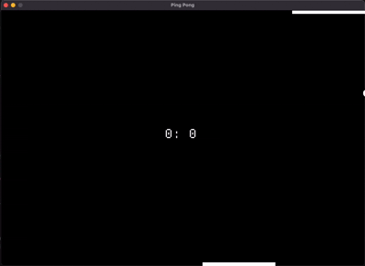

# rust-ping-pong

A simple Ping Pong implementation in Rust using the `macroquad` library.

This is a small learning project.

## Controls

Move the mouse to control your paddle.



## Requirements

- Rust
- Cargo

## Run

```shell
cargo run
```

## Build

```shell
cargo build --release
```
